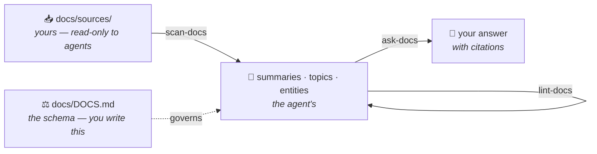

<div align="center">

# 📚 llm-starter-kit

**Give your AI agents a memory of your project.**

Drop it into any repo. It builds a `docs/` folder that every agent reads, maintains, and
answers from — so the next agent doesn't start from zero.

`init-docs` · `scan-docs` · `ask-docs` · `lint-docs`

[**Start here**](#1-paste-this-into-your-agent) · [What it produces](#-what-it-produces) · [How it works](#-how-it-works) · [Any AI agent](#-works-with-any-ai-agent) · [Obsidian](#-obsidian-compatible-by-design)

</div>

---

## The problem

Every agent that opens your repo starts blind. It greps around, half-understands the
architecture, and gives you a confident answer built on a partial reading. Next session, it
does the whole thing again.

You could point it at a vector database — but then the understanding lives in embeddings
nobody can read, review, or correct.

**This kit takes the other path.** The thinking happens *once*, when material comes in, and
the result is markdown you can read.

```
   ┌──────────────────┐                    ┌──────────────────┐
   │       RAG        │                    │    this kit      │
   ├──────────────────┤                    ├──────────────────┤
   │ ask a question   │                    │ material comes in│
   │       ↓          │                    │       ↓          │
   │ search chunks    │                    │ agent reads it   │
   │       ↓          │                    │       ↓          │
   │ hope they're     │                    │ writes linked    │
   │ the right ones   │                    │ pages, flags     │
   │       ↓          │                    │ contradictions   │
   │ answer           │                    │       ↓          │
   │                  │                    │ ask = just       │
   │ 🔒 opaque        │                    │      reading     │
   │ 🔒 not reviewable│                    │                  │
   │ 🔒 re-done every │                    │ ✅ readable      │
   │    single time   │                    │ ✅ reviewable    │
   └──────────────────┘                    │ ✅ compounds     │
                                           └──────────────────┘
```

The trade-off is honest: scanning costs more time and tokens up front. What you get back
survives — you can diff it, review it in a pull request, fix a wrong line by hand, and hand it
to the next agent. A vector index is not something you can read.

---

## 🚀 Quick start

Whichever route you take, commit first — a scan touches many files, and the diff is how you
review what the agent did:

```bash
cd your-project
git commit -am "checkpoint"
```

### 1. Paste this into your agent

**Works everywhere** — Claude Code, opencode, Codex, Cursor, Windsurf, or anything else with
file access. Open the project you want documented and paste this into the chat box:

```
Set up the llm-starter-kit documentation system in this project.

1. Clone https://github.com/fentonmartin/llm-starter-kit into a temp folder
   outside this repo.
2. Copy its docs/, .claude/ and AGENTS.md into this project. Do not overwrite
   anything that already exists here — if a file or folder collides, stop and
   tell me before touching it.
3. Read .claude/skills/init-docs/SKILL.md and follow it exactly: survey this
   project first, then interview me, then write docs/DOCS.md from my answers.
4. Delete the temp folder.

Do not skip the interview and do not answer its questions on my behalf.
Show me the docs/DOCS.md rules you wrote before we go any further.
```

Prefer to copy the files yourself? Same result:

```bash
git clone https://github.com/fentonmartin/llm-starter-kit /tmp/lsk
cp -r /tmp/lsk/docs /tmp/lsk/.claude /tmp/lsk/AGENTS.md your-project/
rm -rf /tmp/lsk
```

Then paste this to start:

```
Read .claude/skills/init-docs/SKILL.md and follow it exactly. Survey this project
first, then interview me before writing anything.
```

<details>
<summary><b>Day-to-day prompts</b> — for agents without slash commands</summary>

<br>

Each skill is a plain markdown file, so pointing an agent at one is the same as running the
command:

```
Read .claude/skills/scan-docs/SKILL.md and follow it.
```

```
Read .claude/skills/ask-docs/SKILL.md and follow it, then answer:
how does session expiry work?
```

```
Read .claude/skills/lint-docs/SKILL.md and follow it. Fix what it says you may
fix, and report the rest to me rather than acting on it.
```

Most agents don't need this much hand-holding once `AGENTS.md` is in the repo — "scan my
sources" or "what do the docs say about X" usually routes correctly on its own.

</details>

### 2. Or install as a Claude Code plugin

**Install** once — it is then available in every repo:

```
/plugin marketplace add fentonmartin/llm-starter-kit
/plugin install llm-starter-kit
```

**Set up** from inside the project you want documented:

```
/init-docs
```

It reads your README, your manifest, and your layout — then asks you five questions:

> - What is this knowledge base for: this codebase, outside research, or both?
> - Who reads it — you, your team, or mostly agents working in this repo?
> - What recurring things deserve a page each? *(your nouns: services, tables, endpoints…)*
> - What must never be got wrong?
> - What's out of scope?

Out comes a `docs/` folder and a `docs/DOCS.md` schema **written for your project**, in your
vocabulary.

**Use it:**

```
/scan-docs                      # read new material, write the pages
/ask-docs how does auth work?   # answer from the pages, with citations
/lint-docs                      # find gaps, contradictions, stale pages
```

> [!TIP]
> After your first `/scan-docs`, run `git diff`. It's the most useful fifteen minutes you'll
> spend with this kit — you see exactly where the agent's judgment differs from yours, and
> that's what the rules in `docs/DOCS.md` exist to correct.

### Already have a `docs/` folder?

`/init-docs` **merges**. It never overwrites and never deletes.

```
BEFORE                          AFTER
docs/                           docs/
├── architecture.md             ├── DOCS.md          ← the schema
├── setup-guide.md              ├── README.md        ← the index
├── vendor-api-spec.pdf         ├── topics/
└── old-notes.md                │   ├── architecture.md      ← kept, front matter added
                                │   └── setup-guide.md
                                ├── sources/
                                │   ├── vendor-api-spec.pdf  ← raw material
                                │   └── old-notes.md         ← unclassifiable → safe here
                                ├── summaries/
                                └── entities/
```

Anything it can't confidently classify goes to `sources/`, where the next scan turns it into
proper pages — **nothing is lost by that default**. It shows you every move as `old → new`
before touching a thing, then fixes inbound links across the repo.

If your `docs/` is built by a site generator (`mkdocs.yml`, `docusaurus.config.js`,
`book.toml`), it won't rearrange anything — it scaffolds at `docs/kb/` and treats your
published docs as sources.

---

## 📄 What it produces

Say you drop a design doc into `docs/sources/`. One `/scan-docs` later:

```
docs/sources/260830-auth-redesign.md
                    │
                    ├──► docs/summaries/260830-auth-redesign.md   what the doc says
                    ├──► docs/topics/session-management.md         synthesis across sources
                    └──► docs/entities/auth-service.md             one subject, stable facts
```

Every page is plain markdown with front matter an agent — and a linter — can check:

```markdown
---
type: topic
title: Session management
created: 2026-08-30
updated: 2026-08-30
sources: [docs/sources/260830-auth-redesign.md, docs/sources/260415-security-audit.pdf]
confidence: high
---

Sessions are issued by [[auth-service]] as opaque tokens, not JWTs, and stored in
[[redis]] with a 24-hour TTL ([[260830-auth-redesign]]).

> [!warning] Contradiction
> [[260830-auth-redesign]] specifies a 24-hour TTL. [[260415-security-audit]] recommends
> 1 hour for admin sessions. Unresolved as of 2026-08-30.

## Open questions
- What happens to in-flight requests when a session is revoked?
```

Three things are happening there that make the difference:

| | |
|---|---|
| 🔗 **`[[wikilinks]]`** | Link to a page that doesn't exist yet and that's *encouraged* — it's a to-do. `lint-docs` ranks them by how many pages point at them, so your biggest gaps surface first. |
| ⚠️ **Contradictions recorded, never resolved** | Two sources disagreeing is a *finding*. Overwriting one destroys the most valuable signal the knowledge base produces. |
| 📎 **Every claim cites its source** | So you can check it, and so `lint-docs` can tell you when the source changed and the page didn't. |

---

## 🛠 The four commands

| Command | What it does | When |
|:--|:--|:--|
| **`/init-docs`** | Surveys the project, interviews you, scaffolds `docs/`, writes a schema for *this* codebase | Once, at the start |
| **`/scan-docs`** | Reads new sources in full, writes a summary each, updates every topic and entity they touch, flags contradictions | When material piles up |
| **`/ask-docs`** | Answers from the pages, with citations. Drops to raw sources only when the pages are thin — and says so | Instead of digging |
| **`/lint-docs`** | Orphans, gaps, contradictions, stale pages, duplicates, schema violations. Fixes the mechanical, escalates the rest | Every few scans |

`/init` `/scan` `/ask` `/lint` work as short aliases. The long names are canonical because this
installs globally — a bare `/lint` would collide with code linters and misfire on *"lint my
code."*

These are [Agent Skills](.claude/skills/), so plain description works too: *"document this
repo"* runs `init-docs`.

---

## 🧩 How it works

Three layers, and the arrow only points one way:



| Layer | Path | Written by | Why it matters |
|:--|:--|:--|:--|
| **Sources** | `docs/sources/` | **you** — append-only | One-way flow means you can always regenerate the pages and compare. If an agent could edit its own inputs, that guarantee is gone. |
| **Pages** | `summaries/` `topics/` `entities/` | **the agent** | Every claim traces to a source or an explicit instruction. `confidence: low` is a valid answer; inventing is not. |
| **Schema** | `docs/DOCS.md` | **you** | The steering wheel. Read below. |

Everything sits under `docs/` so the knowledge base is one self-contained folder you can copy
anywhere. `docs/sources/` is nested for filing only — it stays read-only and exempt from every
page rule.

### The one file that matters: `docs/DOCS.md`

> [!IMPORTANT]
> A generic schema produces generic pages. This is the single biggest reason the kit
> disappoints people. `/init-docs` writes it from your answers — **read what it proposes and
> correct it** before you go further.

It defines your page types, front matter, link style, citations… and your own rules. Vague
rules do nothing. Rules that earn their keep are specific and checkable:

```markdown
- A summary page names the file paths it covers, so lint can tell when the code moved.
- Architectural decisions get a topic page including the alternatives that were rejected.
- Never document intended behavior as actual behavior; if code and comment disagree,
  that is a contradiction, and both go on the page.
- Every claim about a person carries the date it was true.
```

Add more as you notice the agent guessing wrong. Every rule you add improves every future scan.

---

## 🤖 Works with any AI agent

Nothing here is Claude-specific. The kit is markdown and a folder convention — any agent that
can read a file can follow it.

| Tool | Setup |
|:--|:--|
| **Claude Code** | Works as-is — plugin or copied folder |
| **Codex · Cursor · opencode · Windsurf** | Nothing to do. They read the root [`AGENTS.md`](AGENTS.md) automatically |
| **GitHub Copilot** | `cp AGENTS.md .github/copilot-instructions.md` |
| **Gemini CLI** | `cp AGENTS.md GEMINI.md` |
| **ChatGPT / any chat window** | Paste the bootstrap prompt ↓ |

<details>
<summary><b>📋 Bootstrap prompt</b> — for an agent with no repo awareness</summary>

<br>

```
This project is a knowledge base with three layers:

- docs/sources/ — raw material. Read it. NEVER create, edit, rename, or delete anything
                  in it. It is exempt from all page rules.
- docs/         — everything else here is markdown pages you write and maintain. Each must
                  trace back to a source or to something I explicitly told you.
- docs/DOCS.md  — the schema. Read it fully before writing anything. It overrides these
                  instructions.

Four operations, fully specified in .claude/skills/<name>/SKILL.md — read the relevant file
before you begin:

- init-docs → .claude/skills/init-docs/SKILL.md   (set up, once per project)
- scan-docs → .claude/skills/scan-docs/SKILL.md
- ask-docs  → .claude/skills/ask-docs/SKILL.md
- lint-docs → .claude/skills/lint-docs/SKILL.md

Non-negotiable:
- Never resolve a contradiction by overwriting. Record both claims.
- docs/CHANGELOG.md is append-only, newest first.
- docs/README.md lists every generated page exactly once. Keep it current.
- Dates in file names are YYMMDD. Dates inside files are YYYY-MM-DD.

Start with: init-docs, scan-docs, ask-docs QUESTION, or lint-docs
```

In a chat window with no file access, upload `docs/DOCS.md` and the one skill file you need,
then paste the results back into the repo yourself. Clumsy, but the format holds.

</details>

---

## 💎 Obsidian-compatible by design

The page format isn't invented here — it's [Obsidian Flavored
Markdown](https://help.obsidian.md/syntax). Open `docs/` as a vault and everything already
works, no conversion and no plugins:

```
File → Open folder as vault → your-project/docs
```

| What you get | Because |
|:--|:--|
| 🕸️ **Graph view of your knowledge base** | Pages link with `[[wikilinks]]`, so the graph is the real structure — not an approximation |
| 🔗 **Backlinks and unlinked mentions** | Every citation is a link, so any page shows what references it |
| ⚠️ **Callouts render properly** | Contradictions use `> [!warning]`, Obsidian's own syntax |
| 🏷️ **Front matter in the Properties panel** | `type`, `created`, `updated`, `sources`, `confidence` are editable fields, not raw YAML |
| 🔍 **Unresolved links show as your to-do list** | The gaps `lint-docs` reports are the same ones Obsidian greys out |

Everything stays plain markdown in git, so editing a page by hand in Obsidian and having an
agent scan it later are the same workflow. `.obsidian/` is gitignored — your vault settings
stay yours.

> [!NOTE]
> **This kit does not bundle Obsidian skills.** It ships four: `init-docs`, `scan-docs`,
> `ask-docs`, `lint-docs`. What it borrows from
> [kepano/obsidian-skills](https://github.com/kepano/obsidian-skills) is the packaging model
> and the markdown conventions — not the skills themselves.
>
> If you want an agent that can also drive Obsidian directly — Bases, JSON Canvas, the CLI,
> clean web-page extraction — install that plugin alongside this one. They compose: his skills
> handle Obsidian's formats and tooling, these handle what goes in the pages and why.
>
> ```
> /plugin marketplace add kepano/obsidian-skills
> ```

Not an Obsidian user? Nothing is lost — wikilinks are just text, and `docs/DOCS.md` documents
how to switch the whole knowledge base to plain relative markdown links if you prefer.

---

## 📆 A rhythm that works

```
   add sources ─────► /scan-docs ─────► read the git diff
   as you find them   when a few          every time
        │             have piled up            │
        │                                      │
        └──────────── /ask-docs ◄──────────────┘
                   instead of digging
                          │
                   /lint-docs every
                    fifth scan or so
```

- **Commit after each scan.** A scan touches many files; the diff is your review, and your
  undo.
- **Revisit `docs/DOCS.md` monthly.** It's the highest-leverage file in the repo.
- **Watch the gaps.** Dangling wikilinks ranked by inbound count are a reading list, generated
  for free.

Month one it's a filing cabinet. Month six it answers things you'd never have found by
searching, because the connection was made when the material came in.

<details>
<summary><b>🔧 When things go wrong</b></summary>

<br>

| Symptom | Cause | Fix |
|:--|:--|:--|
| Pages are generic and say little | `DOCS.md` still has the shipped defaults, or sources were too few and unrelated | Rewrite the rules; scan three to five files on **one** subject — synthesis needs overlap |
| Same concept split across two pages | Slugs differed on first mention | Lint reports duplicates; merge, then add a naming rule |
| Agent asserts things no source supports | Rules too loose | Add an explicit rule; re-scan that source |
| Pages drifted from their sources | Sources edited after scanning | Lint flags stale pages; re-scan them |
| Summaries are shallow | Agent skimmed a long PDF | Scan that source alone, and say *"read it in full"* |
| Too many dangling links | Normal and healthy | That's your reading list, not a bug |

</details>

---

## 📁 Layout

```
README.md                you are here
AGENTS.md                agent entry point — the rules, and a pointer to the schema
LICENSE
docs/
├── DOCS.md              ⚖️  the schema — page types, front matter, links, your rules
├── README.md            🗂️  the index. every generated page, once.
├── CHANGELOG.md         📜  append-only log of every run
├── sources/             📥  raw material. yours. read-only to the agent.
├── summaries/           📄  one page per source
├── topics/              💡  one page per idea, decision, or flow
└── entities/            🏷️  one page per service, table, person, product…
.claude/skills/          init-docs, scan-docs, ask-docs, lint-docs
.claude/commands/        the four, plus short aliases
.claude-plugin/          install this repo as a Claude Code plugin
```

The `docs/` folder here is the template. `/init-docs` reproduces it inside your project.

---

## 💭 Design notes

<details>
<summary><b>Why "docs" and not "wiki"</b></summary>

A wiki is a destination you visit. Docs sit in the repo next to the thing they describe, get
reviewed in pull requests, and are the natural target when you tell an agent *"build docs for
this project."*

</details>

<details>
<summary><b>Why the agent never writes to <code>docs/sources/</code></b></summary>

One-way flow means you can always regenerate the pages from scratch and compare. If the agent
could edit its own inputs, that guarantee is gone — and a subtly rewritten source is nearly
impossible to spot later.

</details>

<details>
<summary><b>Why contradictions are recorded, not resolved</b></summary>

Overwriting a conflicting claim destroys the most valuable signal the knowledge base produces.
Two sources disagreeing is a finding — often the finding that mattered most.

</details>

<details>
<summary><b>Why the changelog is append-only</b></summary>

It's the audit trail for everything an agent did, and what `lint-docs` reads to tell a rename
from a deletion.

</details>

<details>
<summary><b>Why linking to pages that don't exist is encouraged</b></summary>

A dangling wikilink is a cheap, in-context to-do written at the exact moment the gap was
noticed. `lint-docs` ranks them by inbound link count, so the gaps that matter most surface
first.

</details>

<details>
<summary><b>Why one schema file instead of per-agent config</b></summary>

`docs/DOCS.md` survives switching agents and can be reviewed like any other spec. `AGENTS.md`
points at it rather than restating it — two files of rules would drift, and drift between them
is exactly the failure this kit exists to prevent.

</details>

---

## 🙏 Sources & inspiration

- **[Andrej Karpathy — *LLM Wiki*](https://gist.github.com/karpathy/442a6bf555914893e9891c11519de94f)**
  — the three-layer pattern (raw sources / wiki / schema) and the ingest–query–lint loop this
  kit is built on, here renamed scan–ask–lint. His `index.md` and `log.md` became
  `docs/README.md` and `docs/CHANGELOG.md`.
- **[kepano/obsidian-skills](https://github.com/kepano/obsidian-skills)** — the Agent Skills
  packaging model (`skills/<name>/SKILL.md`, `.claude-plugin/`) and the Obsidian Flavored
  Markdown conventions: wikilinks, callouts, YAML properties. **None of his skills are
  vendored here** — install that plugin alongside this one if you want an agent that can drive
  Obsidian itself. See [Obsidian-compatible](#-obsidian-compatible-by-design).
- **[Agent Skills specification](https://code.claude.com/docs/en/skills)** — the skill format.
- **[Obsidian Flavored Markdown](https://help.obsidian.md/syntax)** — link, embed, and callout
  syntax. Point a vault at `docs/` and the graph view just works.

### What's different here

- Built to be **installed into an existing project**, with `/init-docs` writing a schema from
  an interview rather than shipping a template you're expected to edit later.
- **Merges** with documentation that already exists instead of demanding a clean slate.
- One vocabulary — `docs/`, `sources/`, `DOCS.md` — so it reads naturally pointed at a
  codebase, not only at a reading pile.
- Explicit page types with required front matter, giving `lint-docs` something concrete to
  check rather than vibes.
- A stated split in `lint-docs` between what the agent fixes silently and what it must
  escalate.
- Agent-agnostic by construction: plain-markdown skills and one root `AGENTS.md`.
- **Obsidian-compatible out of the box** — the format is Obsidian Flavored Markdown, so the
  graph view, backlinks and Properties panel work on `docs/` with nothing to convert.

---

## License

Released under the [MIT License](LICENSE). © 2026 Fenton Martin.

Your knowledge base is markdown in a folder — no database, no lock-in, no service to depend on.
Remove this kit tomorrow and every page it wrote still opens in any text editor.

---

<div align="center">

[**Start here**](#1-paste-this-into-your-agent) · [What it produces](#-what-it-produces) · [How it works](#-how-it-works) · [Any AI agent](#-works-with-any-ai-agent) · [Obsidian](#-obsidian-compatible-by-design)

<sub>[Issues](https://github.com/fentonmartin/llm-starter-kit/issues) · [Repository](https://github.com/fentonmartin/llm-starter-kit) · Built on [Karpathy's LLM Wiki](https://gist.github.com/karpathy/442a6bf555914893e9891c11519de94f) and [kepano/obsidian-skills](https://github.com/kepano/obsidian-skills)</sub>

